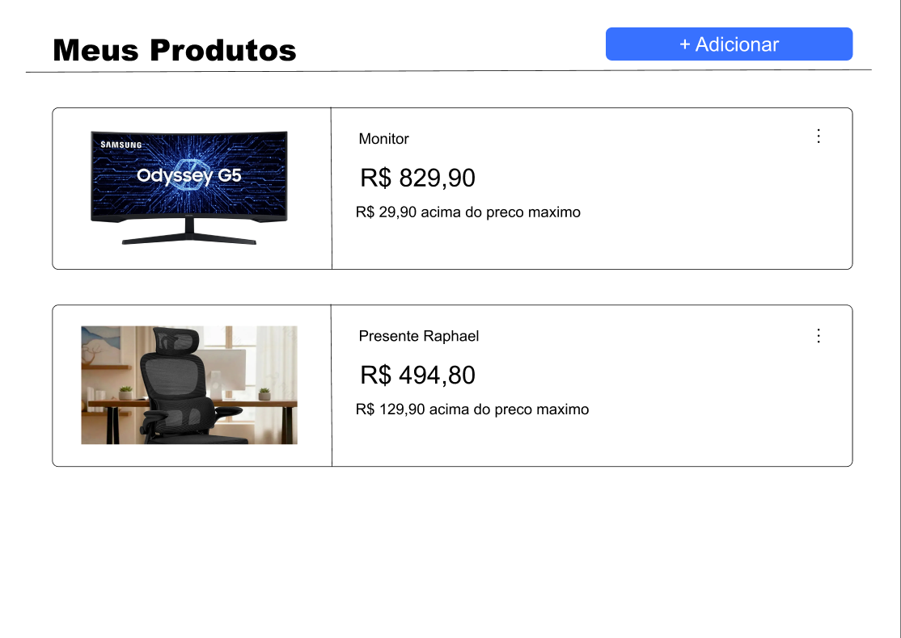
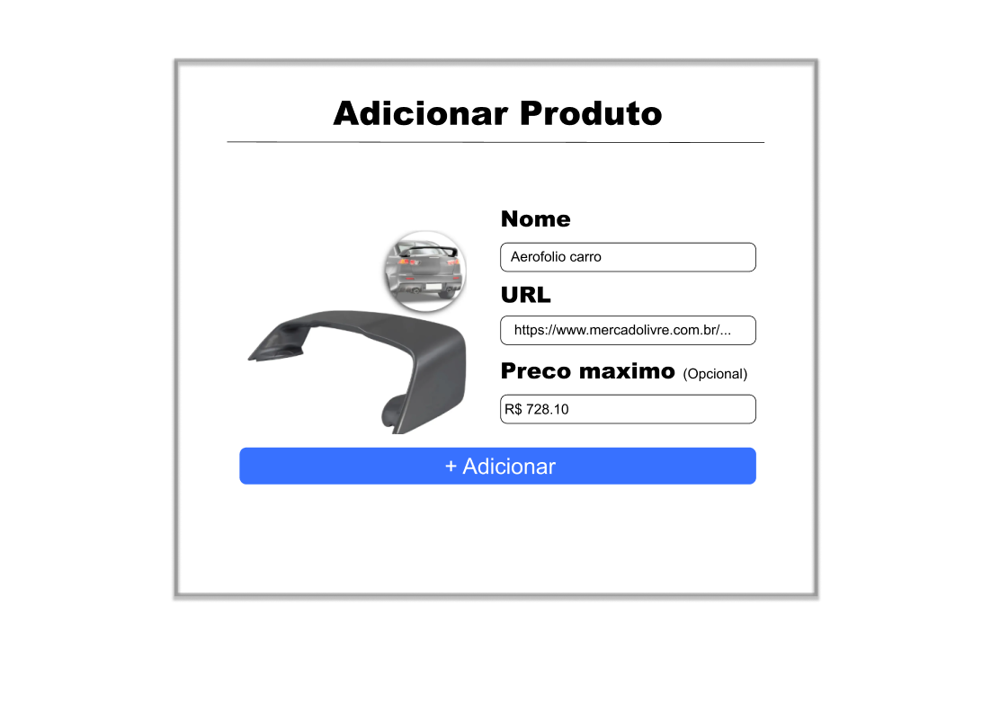

# Design System — Price Watcher

O Design System do Price Watcher define os principais padrões visuais da
interface, buscando manter uma experiência simples, minimalista e consistente
entre as diferentes telas do sistema.

## 1. Cores

A interface utiliza predominantemente branco e cores neutras, mantendo o azul
como cor de destaque para ações e elementos interativos.

### Cor primária

- Azul
- Utilização: botões principais, links e elementos interativos de destaque.

### Cores neutras

- Branco: fundo principal da interface.
- Preto: textos principais e informações de maior importância.
- Cinza: textos e informações secundárias.
- Cinza claro: bordas e separação entre elementos.

### Sucesso

- Verde claro.
- Utilizado em mensagens de confirmação e operações realizadas com sucesso.

### Erro

- Vermelho claro.
- Utilizado em mensagens de erro, alertas e campos inválidos.

Mensagens de erro devem apresentar também uma explicação textual, evitando
depender somente da cor para comunicar o problema.

## 2. Tipografia

A interface utiliza uma escala tipográfica simples para estabelecer hierarquia
entre as informações.

- H1: 24px / Bold
- H2: 20px / Semibold
- H3: 16px / Semibold
- Texto principal: 14px / Regular
- Texto secundário: 14px / Regular
- Texto pequeno: 12px / Regular

Títulos de páginas e informações importantes, como o preço atual de um produto,
devem possuir maior destaque visual.

## 3. Espaçamento

O projeto utiliza uma escala fixa de espaçamento:

- 4px
- 8px
- 16px
- 24px
- 32px
- 48px

Os elementos da interface devem utilizar valores dessa escala para manter
consistência visual entre diferentes telas e componentes.

## 4. Arredondamento

O raio padrão definido para os elementos da interface é:

- 8px

Esse valor deve ser utilizado principalmente em cards, campos de formulário e
botões.

## 5. Componentes

### Card de produto

Componente utilizado na tela principal para representar cada produto
monitorado.

Pode apresentar:

- imagem do produto;
- nome;
- preço atual;
- informação sobre o preço máximo;
- menu de ações.

### Campo de formulário

Os campos de formulário seguem um mesmo padrão de label e input.

Estados previstos:

- normal;
- foco;
- erro;
- desabilitado.

### Botão primário

Utilizado para representar as principais ações disponíveis ao usuário.

Características:

- fundo azul;
- texto branco;
- raio de 8px.

Estados previstos:

- normal;
- pressionado;
- desabilitado.

## 6. Feedback

Mensagens de sucesso devem utilizar tons claros de verde.

Mensagens de erro devem utilizar tons claros de vermelho e apresentar uma
descrição textual do problema.

O objetivo é fornecer feedback ao usuário sem comprometer o estilo visual
minimalista da aplicação.

## Referência visual

A imagem abaixo apresenta a aplicação dos padrões visuais definidos
para o Price Watcher.

