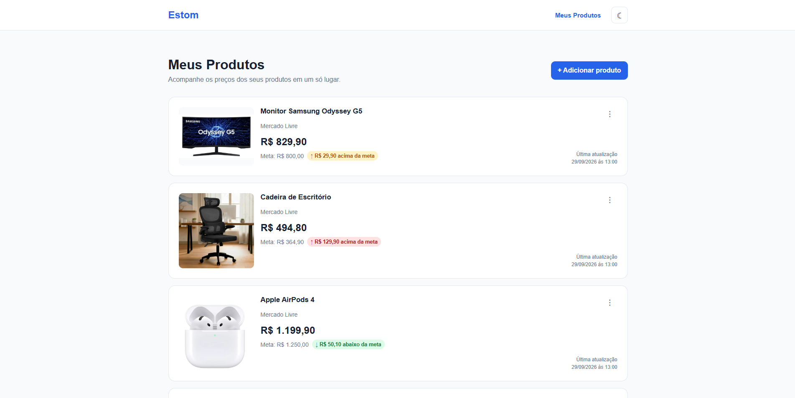
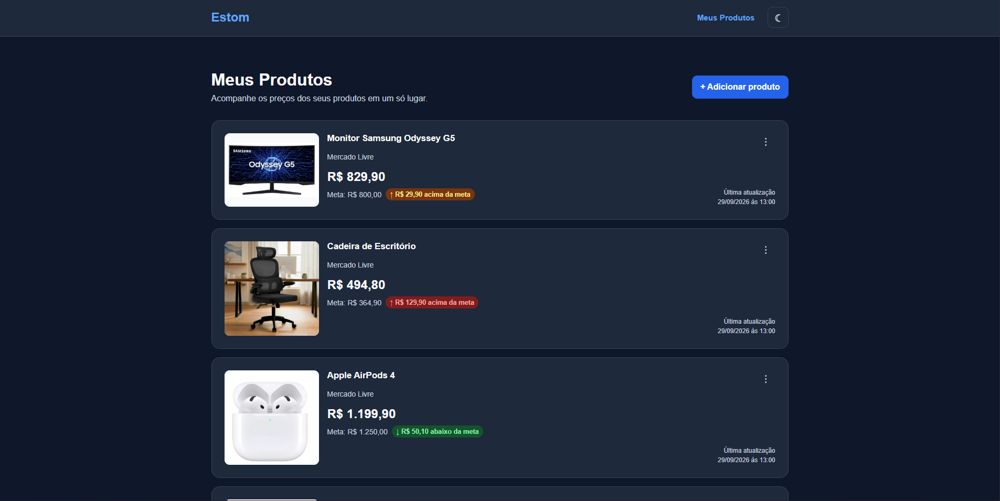
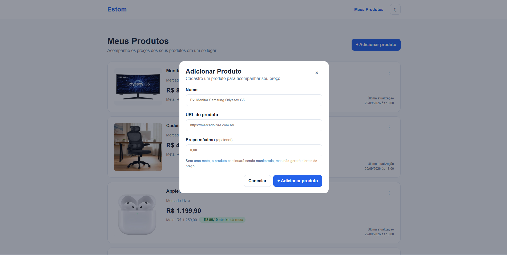
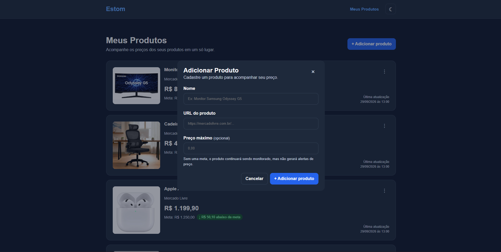

# Design System — Estom

O Design System do Estom define os principais padrões visuais e de interação
utilizados na interface.

O objetivo é manter uma experiência simples, consistente e responsiva,
facilitando também a reutilização dos componentes durante o desenvolvimento
do projeto.

## 1. Cores

O Estom utiliza azul como cor primária da interface, acompanhado por cores
neutras e cores semânticas para representar os diferentes estados dos produtos.

As cores são definidas através de variáveis CSS, permitindo manter consistência
entre os componentes e adaptar a interface aos temas claro e escuro.

### Cor primária

- `--color-primary`: `#2563eb`
- `--color-primary-hover`: `#1d4ed8`
- `--color-primary-text`: `#2563eb`

A cor primária é utilizada principalmente em botões e elementos interativos.

A variável `--color-primary-text` é utilizada em elementos como o logo e o item
ativo da navegação. No tema escuro, ela recebe um tom mais claro para garantir
melhor contraste.

### Cores da interface

- `--color-background`: fundo principal da página.
- `--color-surface`: superfícies como navbar, cards e modal.
- `--color-text`: textos principais.
- `--color-text-muted`: textos secundários.
- `--color-border`: bordas e divisões entre elementos.

### Cores semânticas

O sistema utiliza cores semânticas para representar a situação de um produto
em relação à sua meta de preço:

- Verde: produto abaixo da meta.
- Amarelo: produto pouco acima da meta.
- Vermelho: produto significativamente acima da meta.
- Cinza: produto sem meta definida.

Cada estado possui uma cor de texto e uma cor de fundo próprias.

As cores são sempre acompanhadas por informações textuais, evitando que o
estado do produto seja comunicado apenas através da cor.

## 2. Tema claro e escuro

O Estom possui suporte aos temas claro e escuro.

A troca de tema é realizada através do atributo `data-theme` no elemento
`html`. As variáveis do Design System recebem novos valores quando o tema
escuro está ativo.

Exemplo:

`data-theme="dark"`

No tema escuro são alteradas principalmente:

- cor de fundo;
- cor das superfícies;
- cores dos textos;
- bordas;
- cor primária utilizada em textos;
- cores semânticas.

O botão de tema localizado na navbar permite alternar manualmente entre os
dois modos.

## 3. Tipografia

A interface utiliza Arial como fonte principal, com Helvetica e fontes
sans-serif como alternativas.

A hierarquia tipográfica diferencia títulos, preços, textos principais e
informações secundárias.

### Principais tamanhos

- Logo: `1.5rem`
- Título principal: entre `1.5rem` e `2rem`
- Título do produto: `1.05rem`
- Preço do produto: `1.5rem`
- Navegação: `0.95rem`
- Informações secundárias: `0.875rem`
- Status: `0.8rem`
- Última atualização: `0.75rem`

O título principal utiliza `clamp()` para adaptar seu tamanho de forma fluida
entre diferentes larguras de tela.

## 4. Espaçamento

O projeto utiliza uma escala padronizada de espaçamento baseada em múltiplos
de 8px, com um valor adicional de 4px para pequenos ajustes.

Tokens utilizados:

- `--spacing-xs`: `4px`
- `--spacing-sm`: `8px`
- `--spacing-md`: `16px`
- `--spacing-lg`: `24px`
- `--spacing-xl`: `32px`
- `--spacing-xxl`: `48px`

Esses valores são utilizados em margens, paddings e gaps para manter
consistência entre os componentes.

## 5. Arredondamento

O sistema utiliza três níveis principais de arredondamento:

- `--radius-sm`: `6px`
- `--radius-md`: `10px`
- `--radius-lg`: `16px`

O raio pequeno é utilizado em controles menores, o médio em botões e campos
de formulário e o maior em componentes como cards e modal.

Os indicadores de status utilizam um arredondamento maior para criar o formato
de badge.

## 6. Componentes

### Navbar

A navbar apresenta a identidade do Estom e os principais controles de
navegação.

Atualmente contém:

- logo Estom;
- link para Meus Produtos;
- botão para alternar entre tema claro e escuro.

O item ativo utiliza a cor primária de texto.

### Botão primário

Utilizado nas principais ações da interface, como adicionar um produto.

Características:

- fundo azul;
- texto branco;
- altura mínima de 44px;
- texto em semibold;
- mudança de cor no estado hover.

### Botão secundário

Utilizado em ações alternativas, como cancelar o cadastro de um produto.

Possui fundo transparente e borda neutra para apresentar menor destaque em
relação ao botão primário.

### Botão de tema

Localizado na navbar e utilizado para alternar entre os temas claro e escuro.

O ícone é alterado entre lua e sol de acordo com o tema disponível para
ativação.

### Card de produto

Representa cada produto monitorado na tela principal.

O card pode apresentar:

- imagem do produto;
- nome;
- loja;
- preço atual;
- meta de preço;
- situação em relação à meta;
- data e horário da última atualização;
- menu de ações.

No desktop, imagem e informações são apresentadas lado a lado. Em telas
menores, o conteúdo é reorganizado verticalmente.

O card também possui feedback visual ao passar o mouse.

### Imagem do produto

A imagem utiliza `object-fit: contain` para preservar sua proporção e evitar
cortes.

A área da imagem mantém fundo claro para acomodar as imagens utilizadas nos
anúncios dos produtos.

### Status de preço

Os badges de status comunicam a relação entre o preço atual e a meta definida.

Estados disponíveis:

- `status-success`: abaixo da meta;
- `status-warning`: pouco acima da meta;
- `status-error`: significativamente acima da meta;
- `status-neutral`: sem meta definida.

Cada status combina texto e cor para facilitar sua identificação.

### Menu de ações

Cada card possui um botão representado por três pontos verticais.

O botão reserva espaço para ações relacionadas ao produto e possui nome
acessível através de `aria-label`.

### Modal de adicionar produto

O cadastro de produtos é realizado através de um modal sobreposto à tela
principal.

O modal contém:

- título;
- descrição;
- botão para fechar;
- formulário;
- botão Cancelar;
- botão Adicionar produto.

O modal pode ser fechado através do botão de fechar, do botão Cancelar, de um
clique fora do conteúdo ou pela tecla Escape.

### Campos de formulário

Os campos seguem um padrão composto por label e input.

Atualmente o formulário possui:

- nome do produto;
- URL do produto;
- preço máximo opcional.

Os campos obrigatórios utilizam validação nativa do HTML.

O campo de preço máximo possui também um texto auxiliar explicando o
comportamento do sistema quando nenhuma meta é definida.

## 7. Responsividade

A interface segue uma abordagem mobile-first.

O layout padrão é preparado inicialmente para telas menores e recebe
adaptações conforme a largura disponível aumenta.

### A partir de 768px

- cabeçalho da página passa a ser horizontal;
- cards passam de layout vertical para horizontal;
- imagem do produto recebe largura fixa;
- informação de última atualização é posicionada no canto inferior direito.

### A partir de 1024px

- o espaçamento vertical da área principal aumenta;
- cards recebem padding maior.

O container principal possui largura máxima de `1100px`, evitando que o
conteúdo se espalhe excessivamente em telas grandes.

## 8. Acessibilidade

O Estom utiliza recursos de acessibilidade para tornar a interface mais
compreensível e navegável.

Entre as práticas utilizadas estão:

- HTML semântico;
- hierarquia sequencial de headings;
- textos alternativos nas imagens;
- labels associados aos campos de formulário;
- `aria-label` em botões que utilizam apenas ícones;
- indicador visual de foco através de `:focus-visible`;
- contraste adequado entre texto e fundo;
- estados que não dependem apenas de cores;
- suporte à navegação por teclado;
- fechamento do modal através da tecla Escape.

A interface foi analisada utilizando o Lighthouse e atingiu pontuação 100 na
categoria Accessibility após os ajustes de contraste e hierarquia de títulos.

Também foram realizados testes manuais de navegação por teclado em desktop e
em largura de tela reduzida.

Como melhoria futura, o modal poderá receber um focus trap para impedir que o
foco navegue pelos elementos da página ao fundo enquanto estiver aberto.

## 9. Referência visual

### Tela principal

#### Tema claro

#### Tema escuro

### Modal de cadastro

#### Tema claro

#### Tema escuro

